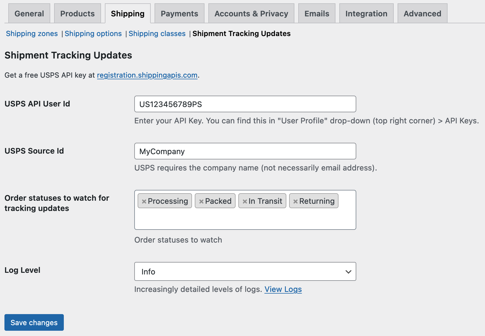

 

# Shipment Tracking Updates

Polls the USPS API for delivery updates.

Adds additional order statuses: `packed`, `in-transit`, `returning`.

Automatically changes order status when: 
* USPS picks up the order
* USPS delivers the order
* USPS is returning the order

### TODO:

* Dispatch email
* Add tracking detail to orders list page
* Add tracking detail to my-account
* Other carriers