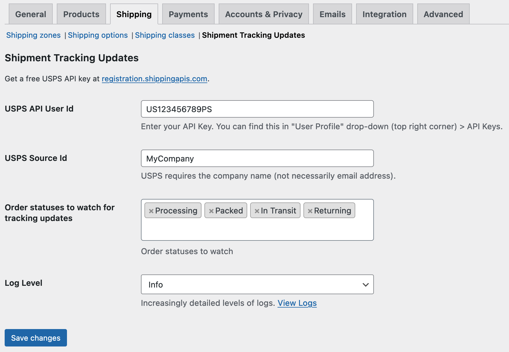
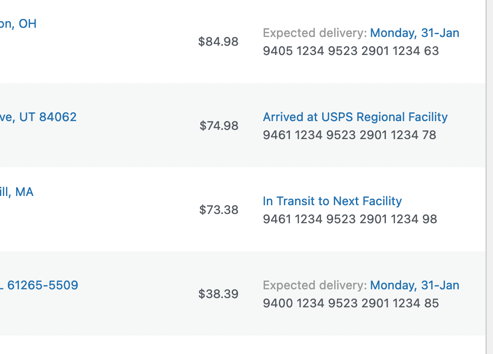
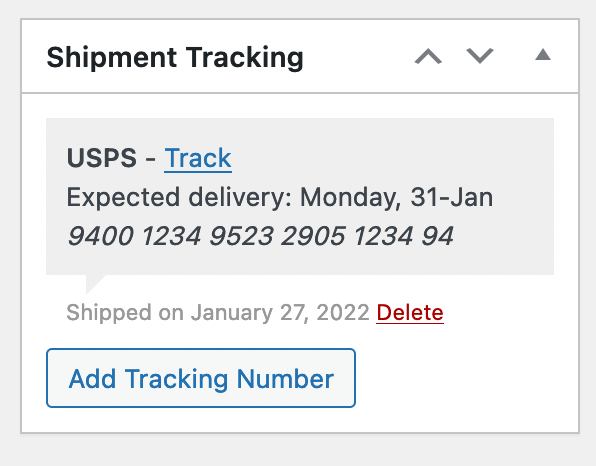

 

# Shipment Tracking Updates

Polls the USPS API for delivery updates.

Adds additional order statuses: `packed`, `in-transit`, `returning`.

Automatically changes order status when: 
* USPS picks up the order
* USPS delivers the order
* USPS is returning the order

### TODO:

* ~~Add tracking detail single order page (for admin) looks like must be JS.~~
* Add tracking detail to my-account (for customer) via templates.
* Show delivery date with order page/list page tracking info.
* Searching orders since x-date not working in API class.
* Handle overseas USPS tracking that stops updating ("presumed delivered") (don't send a complete email since they did get a dispatched email)
* On deactivation, unregister action scheduler actions
* On activation, record the date and display an admin notice to the settings page until viewed
* Admin notice when orders are returning
* Admin notice when orders have not moved for x days (split domestic, international)
* Search option for oldest unmoved? (select packed, sort by date )
* Add bulk order action, single order action on orders list  "mark packed"
* Try to catch when other plugins are setting the order status to completed, is that the correct status?
* Use meta key to only send each email once for each tracking number.
* Warn about custom order statuses accessed via REST API (e.g. fulfillment/dropshipping)
* Gutenberg block for the top of every frontpage to show customers their last order and its status.
* ~~Other carriers ... DHL, UPS~~
* ~~Do not change status from "returning" to "completed"~~
* "delete settings on uninstall" option.
* When a tracking number is added, it should be instantly checked.
* Show delivery date on completed orders.